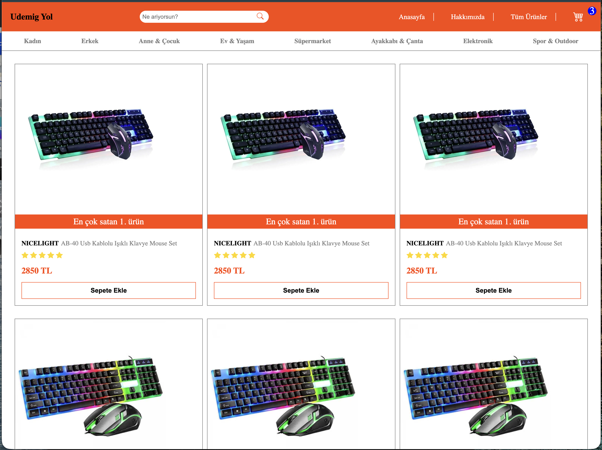

# 🛍 Trendyol Clone

Bu proje, Trendyol’un kullanıcı arayüzünün HTML ve CSS kullanılarak geliştirilmiş bir klonudur.

## 🚀 Özellikler
- Responsive tasarım (mobil uyumlu)
- Ürün kartları
- Slider / banner alanı
- Modern ve kullanıcı dostu UI

## 🛠 Kullanılan Teknolojiler
- HTML5  
- CSS3  

## 📸 Ekran Görüntüleri

## 🎥 Demo

## 📌 Not
Bu proje eğitim amaçlı geliştirilmiştir.
